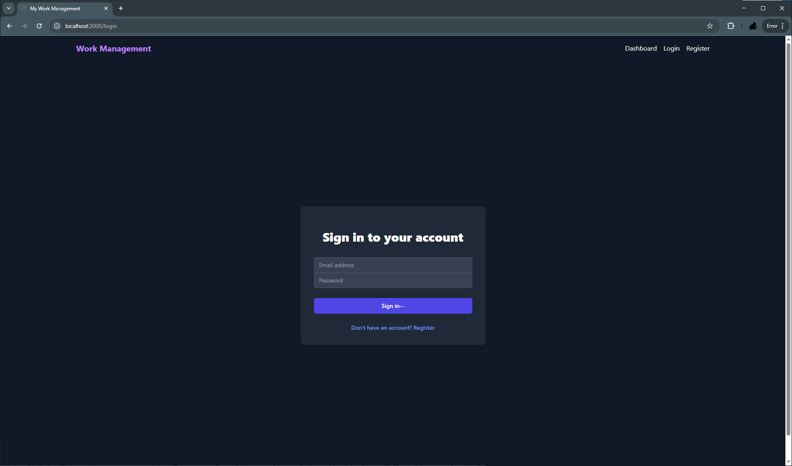
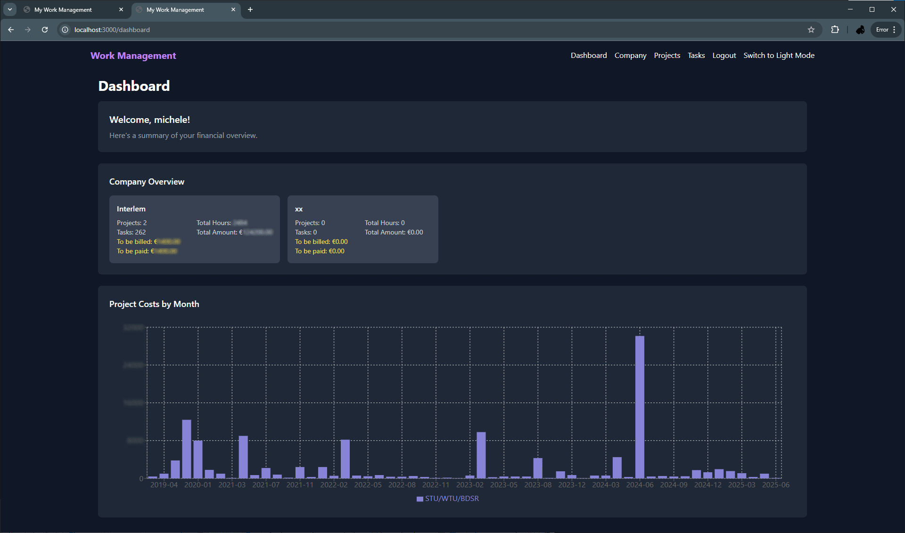
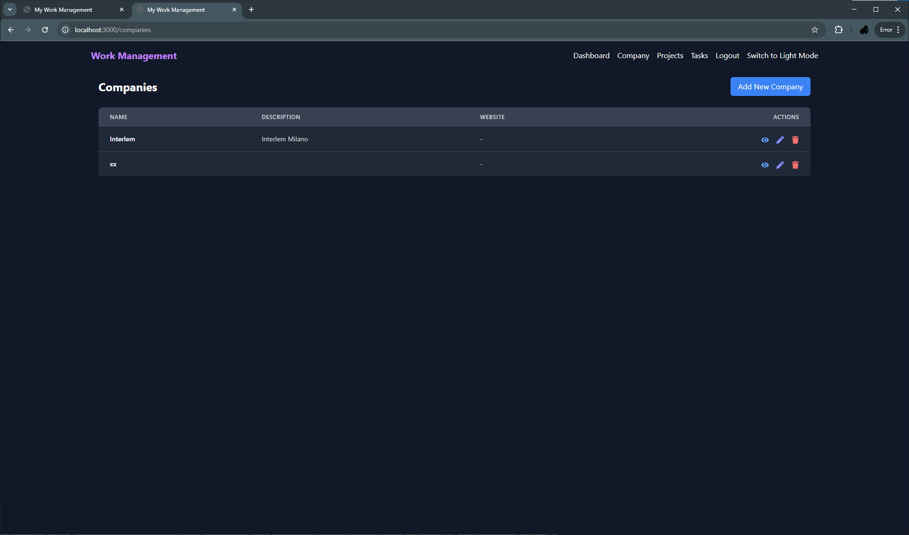
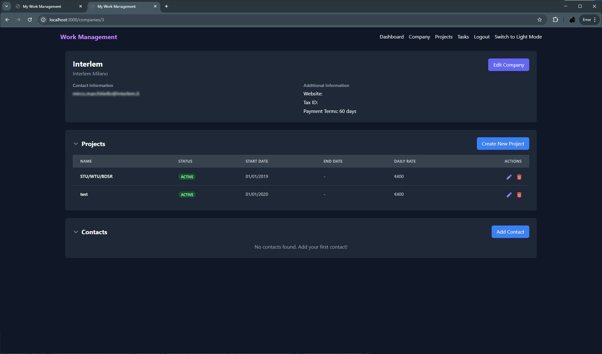
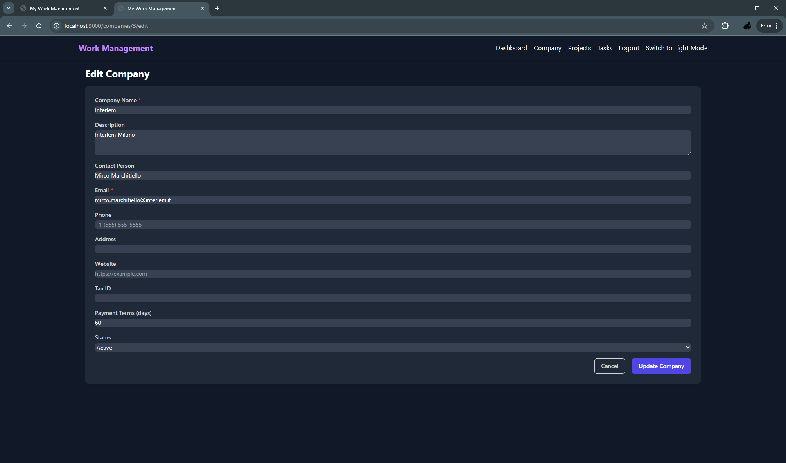
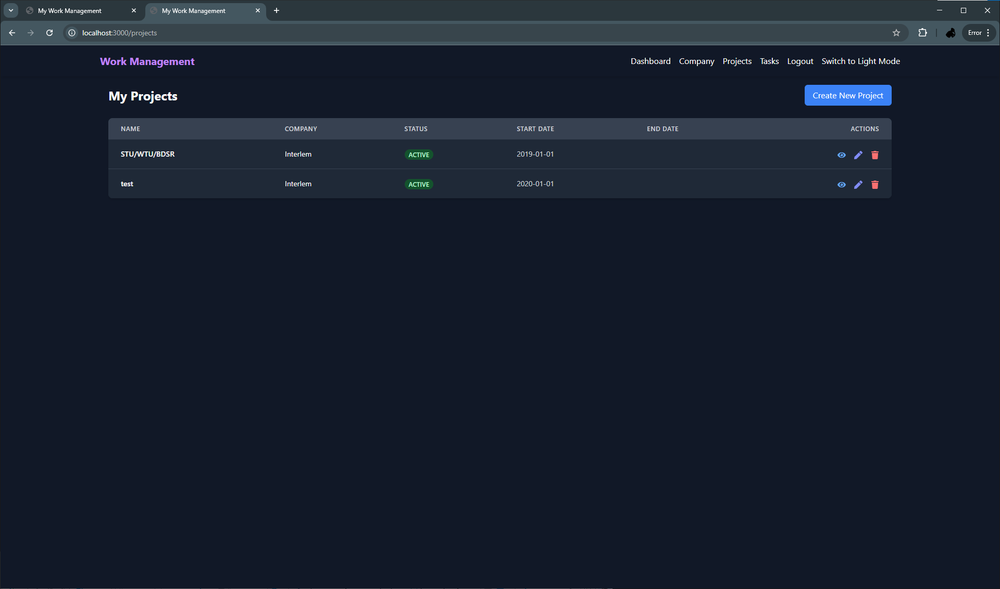
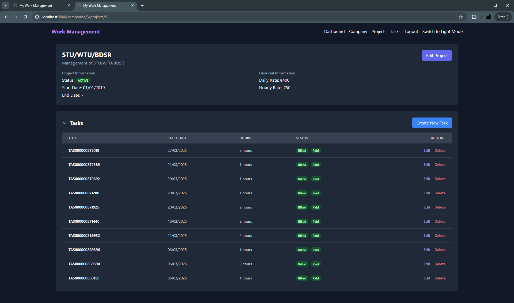
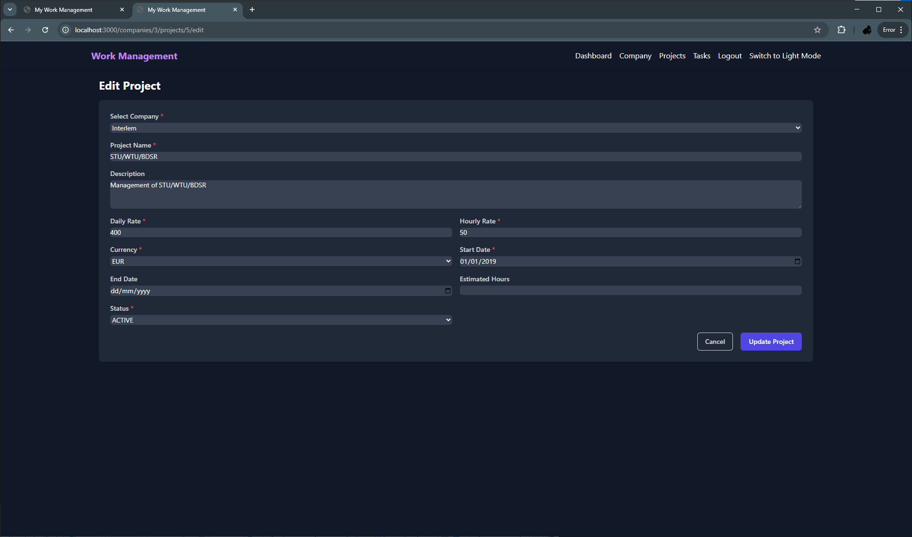

# MyWorkManagement

A modern, full-stack platform for self-employed professionals to manage companies, projects, tasks, billing, and analytics.  
Built with React, Spring Boot microservices, Python AI agent, and Docker for seamless development and deployment.

---

## 🚀 Features

- **Company, Project, and Task Management:** Organize your work, track hours, and manage deliverables.
- **Billing & Payments:** Track billable hours, generate billing info, and monitor payment status.
- **Statistics & Analytics:** Get financial overviews and insights.
- **Authentication & Authorization:** Secure access with user roles.
- **AI Agent:** Python-powered analytics and suggestions.
- **Modern UI:** Responsive, user-friendly React frontend.
- **Easy Setup:** Dockerized databases and services, one-command startup.

---

## 🖼️ Screenshots

Below are some key screens and features of MyWorkManagement:

### Login


### Dashboard


### Company


### Company Details


### Company Edit


### Project


### Project Details


### Project Edit


### Task


### Task Edit


---

## 🗂️ Project Structure

```
MyWorkManagement/
├── frontend/           # React TypeScript frontend
├── backend/            # Spring Boot microservices
│   ├── company-service/
│   ├── auth-service/
│   └── ...             # (other services)
├── ai-agent/           # Python FastAPI AI agent
├── docker/             # Docker Compose files
└── docs/               # Documentation & screenshots
```

---

## 🛠️ Tech Stack

- **Frontend:** React 18, TypeScript, Tailwind CSS, React Router, Axios, Chart.js
- **Backend:** Spring Boot 3, Spring Data JPA, PostgreSQL, OpenFeign, Validation
- **AI Agent:** Python 3.11, FastAPI, OpenAI API, SQLAlchemy, Pandas, NumPy
- **DevOps:** Docker, Docker Compose

---

## ⚡ Quick Start

### 1. Prerequisites

- [Node.js 18+](https://nodejs.org/)
- [Java 17+](https://adoptium.net/)
- [Python 3.11+](https://www.python.org/)
- [Docker & Docker Compose](https://www.docker.com/products/docker-desktop/)

### 2. Clone the Repository

```sh
git clone https://github.com/lapimichele/my-work-management.git
cd MyWorkManagement
```

### 3. One-Command Startup (Recommended)

After configuration, run:

```sh
run_application.bat
```

This script will:
- Wait for Docker to be running
- Start PostgreSQL containers for authentication and company services
- Wait for DBs to be healthy
- Start Java backend services (company-service, auth-service)
- Start the React frontend

---

## 🧑‍💻 Manual Setup

<details>
<summary>Expand for manual setup instructions</summary>

### 1. Start Databases

```sh
cd docker
docker compose -f docker-compose.auth.yml up -d
docker compose -f docker-compose.db.yml up -d
```

### 2. (Optional) Initialize Databases

```sh
# Auth Service DB
docker cp ../backend/auth-service/src/main/resources/db/init.sql auth-service-db:/tmp/init.sql
docker exec -it auth-service-db psql -U postgres -d auth_service_db -f /tmp/init.sql

# Company Service DB
docker cp ../backend/company-service/src/main/resources/db/init.sql company-service-db:/tmp/init.sql
docker exec -it company-service-db psql -U postgres -d company_service_db -f /tmp/init.sql
```

### 3. Start Backend Services

```sh
cd backend/company-service
call ..\mvnw.cmd spring-boot:run

cd ../auth-service
call ..\mvnw.cmd spring-boot:run
```

### 4. Start Frontend

```sh
cd frontend
npm install
npm start
```

### 5. (Optional) Start AI Agent

```sh
cd ai-agent
pip install -r requirements.txt
uvicorn main:app --reload
```
</details>

---

## 🌐 Access

- **Frontend:** [http://localhost:3000](http://localhost:3000)
- **Company Service API:** [http://localhost:8080](http://localhost:8080)
- **Auth Service API:** [http://localhost:8081](http://localhost:8081)
- **AI Agent:** [http://localhost:8000](http://localhost:8000) (if started)

---

## 🧠 AI Agent

The AI agent provides analytics, suggestions, and advanced reporting.  
It is built with FastAPI and integrates with OpenAI for natural language processing.

**Example Endpoints:**
- `POST /analyze-tasks` — Get insights and suggestions for a list of tasks.
- `POST /predict-billing` — Predict billing or payment trends.

**How to use:**
- Start the agent as described above.
- Use the frontend or backend to send requests to the agent for analytics features.

---

## 📚 API Endpoints

### Company Service

| Method | Endpoint                | Description                    |
|--------|------------------------ |--------------------------------|
| GET    | `/api/companies`        | List all companies             |
| GET    | `/api/companies/{id}`   | Get company details            |
| POST   | `/api/companies`        | Create a new company           |
| ...    | ...                     | ...                            |

### Auth Service

| Method | Endpoint                | Description                    |
|--------|------------------------ |--------------------------------|
| POST   | `/api/auth/login`       | User login                     |
| POST   | `/api/auth/register`    | User registration              |
| ...    | ...                     | ...                            |

### Task & Project APIs

| Method | Endpoint                    | Description                    |
|--------|---------------------------- |--------------------------------|
| GET    | `/api/tasks`                | List/filter tasks              |
| PUT    | `/api/tasks/billing-status` | Batch update billing status    |
| PUT    | `/api/tasks/payment-status` | Batch update payment status    |
| ...    | ...                         | ...                            |

> For full API documentation, use the built-in Swagger UI at `/swagger-ui.html` for each backend service.

---

## ⚙️ Configuration

- Environment variables for DBs, ports, etc., can be set in service directories or Docker Compose files.
- For development, you can run only the services you need.

---

## 🩺 Troubleshooting

- Ensure Docker Desktop is running before starting the script.
- If ports are in use, adjust them in Docker Compose and backend configs.
- For Windows, run `run_application.bat` scripts to start docker containers, run the backend services and frontend.

---


*MyWorkManagement is designed to streamline work and financial management for self-employed professionals, with a focus on automation, analytics, and ease of use.*